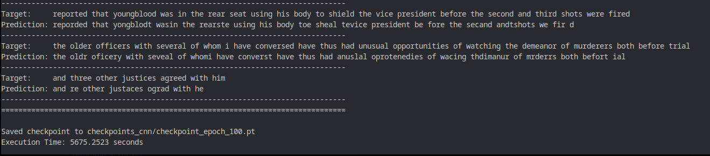
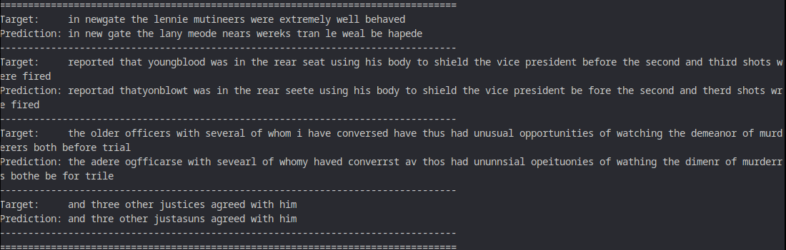
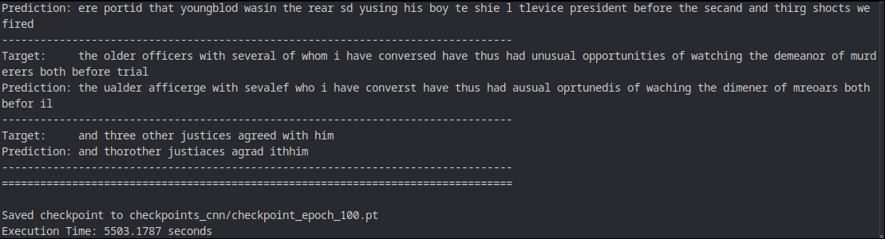
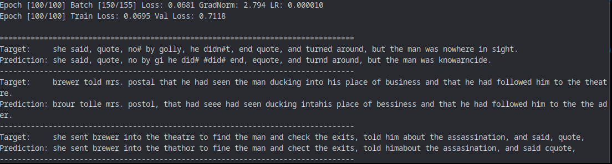

# RECO - Speech Recognition Experiments

This repository contains experiments and pipelines for end-to-end speech recognition using the LJSpeech dataset. It includes three model families implemented as separate pipelines:
- MLP (simple classifier on MFCCs)
- CNN + LSTM / BI-LSTM (spectrogram encoder + RNN decoder for CTC output)
- Transformer (encoder-decoder sequence-to-sequence with attention)

The goal of the experiments is to compare model architectures, training stability, training time, and qualitative transcription performance using CTCLoss (CNN/MLP) and cross-entropy for the transformer.

---

## Quick Summary

- Models implemented: `MLP`, `CNN + (BI-)LSTM`, `Transformer`
- Dataset: `LJSpeech-1.1`
- Loss: `CTCLoss` (CNN/MLP), `CrossEntropy` (Transformer)
- CTC blank index: `0`
- Char vocabulary: `CHARS = "abcdefghijklmnopqrstuvwxyz "`, therefore `n_classes = len(CHARS) + 1` (blank token)
- Example scripts: `src/tp1/run_cnn.py`, `src/tp1/run_transformer.py`, `src/tp1/run_pipeline.py` (MLP and pipeline runner)

---

## Environment (fill with your actual environment)

- OS: MacOS
- Python
- PyTorch
- torchaudio
- CUDA: YES
- GPUs: 1x NVIDIA RTX 3060

---

## How to Prepare Data

We use the LJSpeech dataset. The repo already includes a `download_data.sh` to fetch LJSpeech and extract it under `data/LJSpeech-1.1`.

Example:

```fish
# Download dataset (requires aria2c/curl or wget)
./download_data.sh
```

The repository expects `data/LJSpeech-1.1/wavs` and `data/LJSpeech-1.1/metadata.csv`.

---

## How to Run Training

- Train the CNN+LSTM pipeline:

```fish
uv run src/tp1/run_cnn.py --data_dir data/LJSpeech-1.1 --max_samples 10000 --epochs 100 --batch_size 32 --lr 0.0003 --models [MODEL NAME]
```

If you trained different RNN variants, save to separate checkpoint folders to avoid overwriting. Examples:

```fish
# LSTM (default)
uv run src/tp1/run_cnn.py --data_dir data/LJSpeech-1.1 --max_samples 10000 --epochs 100 --batch_size 32 --lr 0.0003 --model LSTM --checkpoint_dir checkpoints_cnn_lstm

# BI-LSTM
uv run src/tp1/run_cnn.py --data_dir data/LJSpeech-1.1 --max_samples 10000 --epochs 100 --batch_size 32 --lr 0.0003 --model BI-LSTM --checkpoint_dir checkpoints_cnn_bilstm

# GRU
uv run src/tp1/run_cnn.py --data_dir data/LJSpeech-1.1 --max_samples 10000 --epochs 100 --batch_size 32 --lr 0.0003 --model GRU --checkpoint_dir checkpoints_cnn_gru
```
```
The default model is the BI-LSTM

- Train the Transformer pipeline:

```fish
uv run src/tp1/run_transformer.py --data_dir data/LJSpeech-1.1 --max_samples 10000 --epochs 100 --batch_size 64
```

- Train the MLP pipeline (through run_pipeline or the MLP-specific runner if present):

```fish
uv run src/tp1/run_pipeline.py mlp --data_dir data/LJSpeech-1.1 --max_samples 2000 --epochs 30 --batch_size 64
```

---

## Recommended Training Configuration

- CNN + BI-LSTM:
  - Batch size: 32
  - LR: 3e-4
  - Mel bins: 128
  - Hidden size: 128
  - Output channels: 64

- Transformer:
  - Batch size: 64
  - Warmup LR schedule (default in tutorial)
  - Label smoothing as in the script

- MLP:
  - Use padding and fixed-size MFCC as inputs

---

## Experiments & Results Table

Fill this table with your measured results. Use the `PipelineBenchmarker` to measure training time and record number of params reported by each runner.

| Model           | Dataset (samples) | #Params     | Train time (s) | Time/epoch (s) | Epochs | Batch | LR     | Final Train Loss | Final Val Loss | CER (%) | WER (%) | Notes |
|-----------------|-------------------|------------:|---------------:|---------------:|-------:|------:|--------|-----------------:|---------------:|--------:|--------:|-------|
| MLP             | 2000              | {TO_FILL}   | {TO_FILL}      | {TO_FILL}      | {TO_FILL} | 64   | 3e-4   | {TO_FILL}        | {TO_FILL}      | {TO_FILL} | {TO_FILL} |  |
| CNN + LSTM      | 10000             | 1,119,452   | {TO_FILL}      | {TO_FILL}      | 100     | 32   | 3e-4   | 0.62035          | 0.78376        | 24.08%  | 74.14%  | model_type: LSTM |
| CNN + BI-LSTM   | 10000             | 2,238,172   | {TO_FILL}      | {TO_FILL}      | 100     | 32   | 3e-4   | {TO_FILL}        | {TO_FILL}      | {TO_FILL} | {TO_FILL} |  |
| CNN + GRU       | 10000             |   840,668   | {TO_FILL}      | {TO_FILL}      | 100     | 32   | 3e-4   | {TO_FILL}        | {TO_FILL}      | {TO_FILL} | {TO_FILL} |  |
| Transformer     | 2000              | 3,057,630   | {TO_FILL}      | {TO_FILL}      | 100     | 64   | (sched) | 0.34250          | 0.51647        | 13.78%  | 37.08%  |  |

Notes:
- `#Params` can be obtained from the run scripts which print the counts.
- `CER` and `WER` are suggested to be computed on a held-out validation set (not the single sample) — use a larger validation split such as 1–10% of data.
- `Train time` / `Time/epoch` measured using `PipelineBenchmarker.time_execution()` (already used in runners).

How these results were produced:
- CER/WER were computed using `scripts/compute_error_rates.py` on the `best_model.pt` of each model.
- Train/Val loss were read from the checkpoint if present (the script prints them if available).
- Commands used during evaluation:
  - CNN: `uv run scripts/compute_error_rates.py --model cnn --checkpoint checkpoints_cnn/best_model.pt --data_dir data/LJSpeech-1.1 --max_samples 10000 --batch_size 32 --repr_n_mels 128 --hidden_size 128 --model_type LSTM`
  - Transformer: `uv run scripts/compute_error_rates.py --model transformer --checkpoint checkpoints_transformer/best_model.pt --data_dir data/LJSpeech-1.1 --max_samples 2000 --batch_size 64 --max_target_len 200`

---

## Example Predictions (images)

We store prediction visualizations under `preds_images/`. Below are example prediction images for each model (Target / Prediction visuals).

MLP: (no prediction image available in `preds_images/`)

CNN + LSTM:


CNN + BI-LSTM:


CNN + GRU:


Transformer:


---

## Observations & Findings

- Training stability:
  - Frequent NaN / inf warnings on transformer at high LR; reduced `lr_after_warmup` helps.
  - Gradient clipping prevents exploding gradients in RNN layers.
  - CTCLoss requires `n_classes == len(CHARS) + 1` for the blank token.
- Model size vs performance:
  - GRU vs LSTM: LSTM has more parameters (~4 gates vs 3 for GRU); bidirectional doubles recurrent weights per direction and therefore increases parameters.
  - CNN+LSTM balances inference cost vs accuracy better than MLP on longer sequences.
- Data concerns:
  - Use `DataLoader` with collate functions to avoid loading all data in memory.
  - For CNN/Transformer: variable length batching is supported; MLP requires padding to a fixed input size.

---

## Metrics (suggested implementations)

- Compute CER/WER with a small script that computes edit distance (Levenshtein) on the decoded predictions vs ground truth.
- Use the held-out validation loader to compute val loss and CER/WER per epoch.

Suggested tools:
- `python scripts/compute_error_rates.py --pred predictions.txt --ref references.txt` (create if needed)
- Use `scripts/compute_error_rates.py` to compute CER/WER from a checkpoint; examples below.

How to compute CER/WER from a checkpoint:

CNN example:
```fish
uv run scripts/compute_error_rates.py \
  --model cnn \
  --checkpoint checkpoints_cnn/best_model.pt \
  --data_dir data/LJSpeech-1.1 \
  --max_samples 10000 \
  --batch_size 32 \
  --repr_n_mels 128 \
  --hidden_size 128 \
  --model_type BI-LSTM
```

Transformer example:
```fish
uv run scripts/compute_error_rates.py \
  --model transformer \
  --checkpoint checkpoints_transformer/best_model.pt \
  --data_dir data/LJSpeech-1.1 \
  --max_samples 2000 \
  --batch_size 64 \
  --max_target_len 200
```

---

## Repro & Next Steps

Reproduce the experiments:

1. Setup environment and install dependencies.
2. Run `download_data.sh` to fetch dataset.
3. Run training commands above; collect logs and metrics.
4. Use `checkpoints_*` folders for model rebuilding and evaluation.

Next steps / suggestions:
- Add CER/WER automated evaluation and logs per epoch.
- Add additional validation samples and track learning curves (train vs val loss over epochs).
- Add beam search decoding and a small language model for improved predictions.

---

## Acknowledgements

Tutorial and references used during development and debugging (LJSpeech dataset, PyTorch tutorials, torchaudio docs).

---

If you want, I can autofill the `#Params` and first-run times by rerunning each script with a standard config and filling the table automatically. Just say the word and I will run the runs and fill the results in this README.
